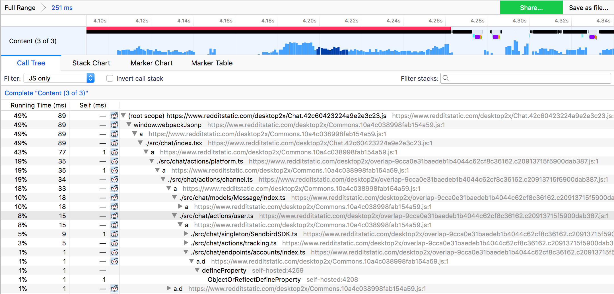

# JavaScript Self-Profiling API Proposal

- [Specification](https://wicg.github.io/js-self-profiling)
- [Web Platform Tests](https://wpt.fyi/results/js-self-profiling?label=experimental&label=master&aligned)
- Slides and minutes from TPAC [2018](https://docs.google.com/document/d/1bYMLTkjcyOZR5Jt3vrulzMSoS32zOFtwyH33f6hW_C8/edit#heading=h.se3632b9q5z), [2019](https://docs.google.com/document/d/1-xMvUHAjqhQdegNqupxlqsLbfPHWq5MJ0iySg9Z1KBs/edit#heading=h.uq5au3okuh8b), [2020](https://docs.google.com/document/d/1inejuvPONXPOLKTCcUzOBhPh6QOckMcltnR-E3xyZVQ/edit#heading=h.9uskdhbxdwkg)
- GitHub issues + [WICG discourse thread](https://discourse.wicg.io/t/proposal-an-api-to-allow-webpage-javascript-to-profile-its-own-performance/2818)

## Motivation

Currently it is difficult for web developers to understand how their applications perform in the wide variety of conditions encountered on real user devices. A programmable JS profiling API is needed to collect JS profiles from real end-user environments.

A native self-profiling API for JS code would also allow web developers to efficiently find hotspots in their JS code during page loads and user interactions, to assign CPU budgets to individual JS-implemented features on the page, to find unnecessary work being done on the client, and to find low-priority JS code executing in the background and wasting device power.

Currently JS self-profiling can be accomplished by instrumenting individual JS functions with timing code but this is cumbersome, bloats JS size, changes the code (potentially altering performance characteristics), adds overhead from timing calls, and risks missing out on hotspots in unexpected corners.

### Facebook's Profiler Polyfill

In an attempt to polyfill the missing self-profiling functionality, Facebook built and deployed its own in-page JS profiler implemented with JavaScript and SharedArrayBuffers. This JS profiler was implemented using a worker thread that signaled to the main thread when it needed to record its current stack. The worker thread would toggle a “capture stack now” flag in a SharedArrayBuffer every few milliseconds, and the value of this flag was read by instrumentation code that was inserted at transpilation time into the beginning of interesting JS functions running on the main thread. If the instrumentation code saw that the flag was set, it would capture the current JS stack (using the Error object) and add it to the running profile.

This JS profiler was enabled for only a small percentage of Facebook users, and only instrumented functions of 10 statements or more in order to limit performance impact and to limit the quantity of profiling data collected. Nevertheless, we found it extremely valuable for understanding Facebook.com's performance in the field and for finding optimization opportunities. 

This polyfill implementation had some downsides:

* The size overhead of the added instrumentation required limiting the fraction of functions instrumented (resulting in incomplete coverage)
* The sampling “interrupt” was not instant so stacks were collected from the **_next_** instrumented function which added a lot of noise to the dataset and made it difficult to reason about
* The performance overhead limited the sampling frequency and fraction of pageloads profiled
* Our design depended on SharedArrayBuffers, which have been disabled on the Web for the time-being, so the profiler is disabled for now

A browser-implemented profiling API would avoid these downsides.

### Wider Industry Interest

It is cumbersome to manage instrumentation for performance measurement, regardless of whether it is inserted by build-time tooling (like Facebook's polyfill above) or inserted by hand in functions of interest. This API eliminates the need to maintain performance instrumentation and therefore allows smaller sites to deploy in-page JS profiling.

We also expect that third-party analytics providers will offer libraries or infrastructure to record, ingest, aggregate and automatically analyze the collected profiles for optimization opportunities, thus further lowering the barrier to entry.

Finally, several other Web properties with large codebases have expressed interest to us for using this API to better monitor their webapps performance in the field.

## API Overview

Developers can start a new profiler with `new Profiler(options)`, where `options` contains the following required fields:

- `sampleInterval`: Target sample rate (in ms per sample)
  - The UA may choose a different sample rate than the one that the user requested (which must be the next lowest valid sampling interval).
    - The true sample rate of the profiler may be accessible via `profiler.sampleInterval`.
- `maxBufferSize`: Maximum sample capacity (in samples)
  - If the sample buffer capacity is reached, the `samplebufferfull` event is sent to the `profiler` object. This stops profiling immediately.
    - The trace may still be collected via `profiler.stop()` when this occurs.

Creating a new profiler starts profiling immediately. Once the developer wishes to stop profiling, calling `profiler.stop()` returns a promise containing a trace object that can be sent to a server for aggregation.

> This trace is encoded in a trie format similar to the GeckoProfiler and Chrome tracing formats -- see the appendix for an overview of how stacks are represented.

An example of how you might want to profile a pageload for server-side analysis is below:

```javascript
const profiler = new Profiler({
  sampleInterval: 10,      // Target sampling every 10ms
  maxBufferSize: 10 * 100, // Cap at ~10s worth of samples
});

async function collectAndSendTrace() {
  if (profiler.stopped) return;

  const trace = await profiler.stop();
  const traceJson = JSON.stringify({
    timing: performance.timing,
    trace,
  });

  // Send the trace JSON to a server via Fetch/XHR
  sendTrace(traceJson);
}

profiler.addEventListener('samplebufferfull', collectAndSendTrace);
window.addEventListener('load', collectAndSendTrace);

// Rest of the page's JS initialization logic
```

## Markers Extensions

See [markers](markers.md) for detailed description of the proposal.

## Privacy and Security

See the [Privacy and Security](https://wicg.github.io/js-self-profiling/#privacy-security) section of the spec.

## Appendix: Profile Format

A trie-like approach is chosen for representing traces obtained from the profiler. There are examples of trie-based approaches in browsers today:

* [Chrome's Trace Event format, specifically the stackFrames field](https://docs.google.com/document/d/1CvAClvFfyA5R-PhYUmn5OOQtYMH4h6I0nSsKchNAySU/preview#heading=h.yr703knxre9f)
* [Firefox's Gecko Profiler format, specifically the stackTable field](https://github.com/devtools-html/perf.html/blob/master/docs-developer/gecko-profile-format.md#source-data-format)

The API aims to provide deduplication of script resource URLs, stack frames, and stack sequences (through the aforementioned trie approach) to reduce memory pressure and trace size when sent over the network.

The specification's processing model provides detail on how these traces are constructed. An example (encoded in JSON) can be found below:

```javascript
{
  "resources" : [
    "https://static.xx.fbcdn.net/rsrc.php/v3/yW/r/ZgaPtFDHPeq.js",
    "https://static.xx.fbcdn.net/rsrc.php/v3iMKu4/yW/l/en_US-i/gSq3sO3PcU1.js"
  ],
  "stacks" : [
    {
      "frameId" : 0
    },
    {
      "frameId" : 1,
      "parentId" : 0
    },
    {
      "frameId" : 2,
      "parentId" : 1
    }
  ],
  "samples" : [
    {
      "timestamp" : 1551.73499998637,
      "stackId": 2
    },
    {
      "timestamp" : 1576.83999999426,
      "stackId": 1
    },
    {
      "timestamp" : 1601.90499993041
    }
  ],
  "frames" : [
    {
      "name" : "b",
      "resourceId" : 0,
      "line" : 23,
      "column" : 169
    },
    {
      "name" : "l",
      "resourceId": 1,
      "line" : 313,
      "column" : 468
    },
    {
      "name" : "a",
      "resourceId": 1,
      "line" : 313,
      "column" : 1325
    }
  ]
}
```

The API may also be combined with other APIs such as [Compression Streams](https://wicg.github.io/compression/) in order to further reduce trace size.

### Visualization

Mozilla's perf.html visualization tool for Firefox profiles or Chrome's trace-viewer (chrome://tracing) UI could be trivially adapted to visualize the data produced by this profiling API.

### perf.html

As an illustration, a screenshot below from Mozilla's perf.html project shows the JS stack aggregation and timeline. It is able to show gaps where JavaScript was not executing, areas where there were long running events (red), and an aggregate view of the samples in the selected time range such as the 15 contiguous samples in function 'user.ts' highlighted in the screenshot below.



